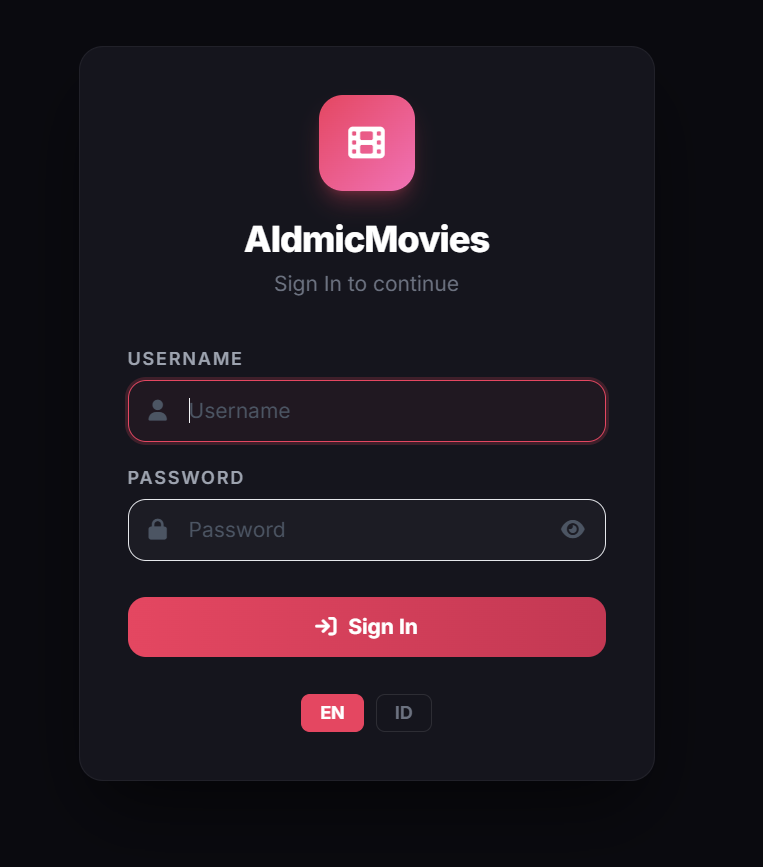
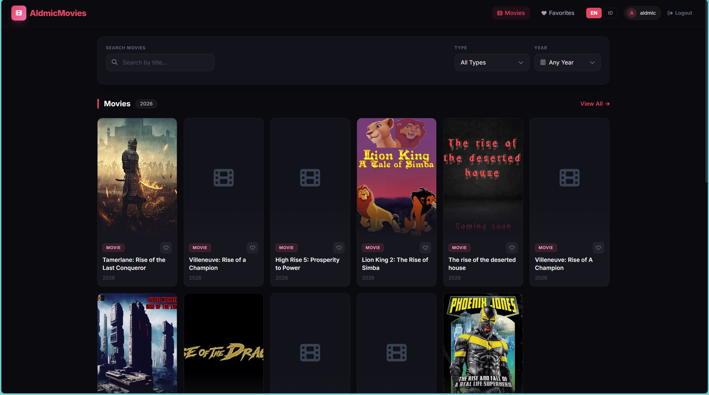
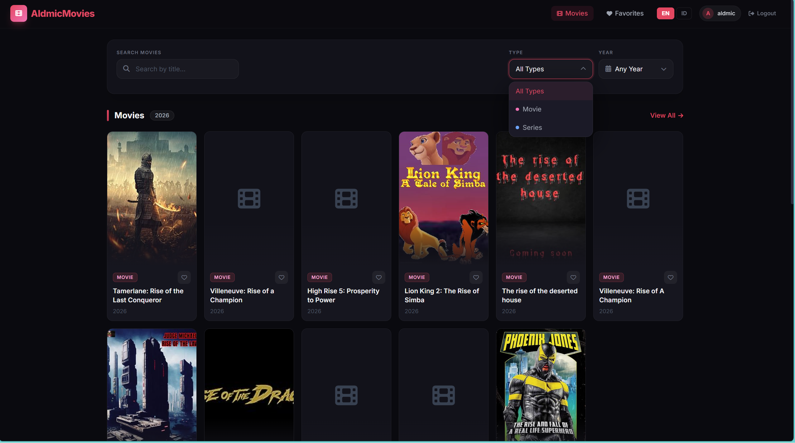
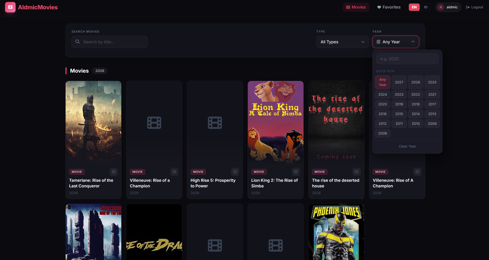
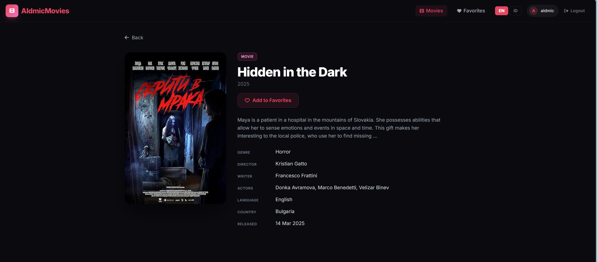
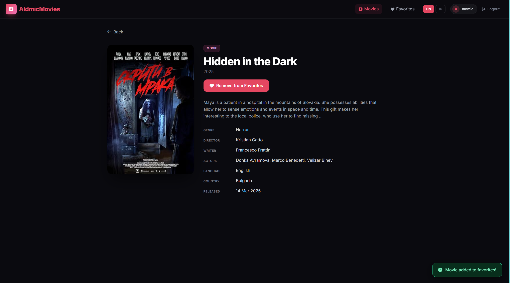
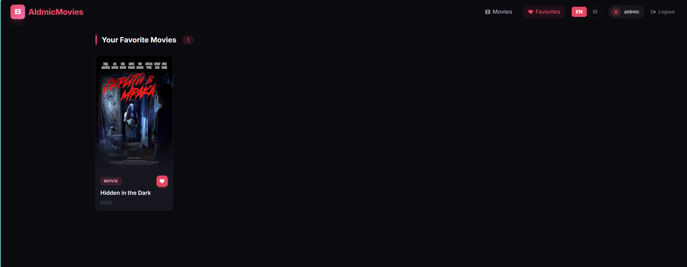

# AldmicMovies

A Laravel 5.8 movie search and favorites application powered by the [OMDb API](http://www.omdbapi.com/).

---

## Ketentuan & Implementasi

Berikut ini adalah daftar ketentuan teknis test beserta status implementasinya:

| # | Ketentuan | Status |
|---|---|---|
| 1 | Halaman Login (username: `aldmic`, password: `123abc123`) | ✅ Implemented |
| 2 | Halaman List Movie | ✅ Implemented |
| 3 | Halaman Detail Movie | ✅ Implemented |
| 4 | Login wajib sebelum akses List / Detail Movie | ✅ `AuthCheckMiddleware` |
| 5 | Pesan error jika credential salah | ✅ Validation error shown on login |
| 6 | Pencarian movie berdasarkan judul, tipe, dan tahun | ✅ Search + filter |
| 7 | Klik movie → tampil halaman detail | ✅ Route `/movies/{imdbId}` |
| 8 | Tambah Favorite dari halaman List Movie | ✅ Favorite button per card |
| 9 | Tambah Favorite dari halaman Detail Movie | ✅ Add/Remove button on detail |
| 10 | Halaman Daftar Favorite tersendiri | ✅ Route `/favorites` |
| 11 | Hapus Favorite dari halaman Favorites | ✅ Implemented |
| 12 | Infinite Scroll pada halaman List Movie | ✅ `IntersectionObserver` API |
| 13 | Lazy Load pada gambar/poster Movie | ✅ `data-src` lazy loading |
| 14 | Multi Language ID / EN (default EN) | ✅ `LocaleMiddleware` + `lang/` |
| 15 | Lokalisasi hanya untuk teks statis (bukan data API) | ✅ Semua teks pakai `__('app.xxx')` |
| 16 | Empty state jika data kosong | ✅ Empty state UI |
| 17 | README dengan library, arsitektur, dan screenshot | ✅ Dokumen ini |

---

## Features

- **Login Page** — Secure session-based authentication (credentials: `aldmic` / `123abc123`)
- **Movie List** — Search movies by title, filter by type and year
- **Infinite Scroll** — Automatically loads more results as user scrolls (via IntersectionObserver API)
- **Lazy Loading** — Movie poster images are lazily loaded for optimal performance
- **Movie Detail** — Full movie information from OMDb API
- **Favorites** — Add/remove favorites from List or Detail pages, persisted in MySQL
- **Multi Language** — English (EN) and Indonesian (ID) with runtime language switching
- **Empty State** — Friendly UI when no data is available

---

## Architecture

This project follows the **Repository Pattern** with **Service Layer** on top of standard Laravel MVC:

```
app/
├── Http/
│   ├── Controllers/
│   │   ├── AuthController.php        ← Handles login / logout
│   │   ├── MovieController.php       ← Movie list, search, detail, AJAX load-more
│   │   └── FavoriteController.php    ← CRUD favorites
│   ├── Middleware/
│   │   ├── AuthCheckMiddleware.php   ← Protects routes from unauthenticated access
│   │   └── LocaleMiddleware.php      ← Sets app locale from session
├── Models/
│   └── Favorite.php                  ← Eloquent model for favorite movies
├── Repositories/
│   ├── Contracts/
│   │   └── FavoriteRepositoryInterface.php  ← Interface (contract)
│   └── FavoriteRepository.php        ← Concrete DB implementation
├── Services/
│   └── OmdbService.php               ← Wraps OMDb API via GuzzleHTTP
└── Providers/
    └── AppServiceProvider.php         ← Binds interface → implementation, registers GuzzleHTTP

database/
└── migrations/
    └── 2026_02_26_081214_create_favorites_table.php

resources/
├── lang/
│   ├── en/app.php                    ← English translations
│   └── id/app.php                    ← Indonesian translations
└── views/
    ├── layouts/app.blade.php         ← Main layout (navbar, footer, toasts)
    ├── auth/login.blade.php          ← Login page
    ├── movies/
    │   ├── index.blade.php           ← Movie search & list with infinite scroll
    │   └── detail.blade.php          ← Movie detail page
    ├── favorites/
    │   └── index.blade.php           ← Favorites list page
    └── partials/
        └── movie-card.blade.php      ← Reusable movie card component
```

**Data Flow:**
```
Request → Controller → Service (OMDb API) or Repository (DB) → View
```

---

## Libraries Used

| Library | Version | Purpose |
|---|---|---|
| **Laravel** | 5.8.x | PHP MVC framework |
| **GuzzleHTTP** | ^7.0 | HTTP client for OMDb API requests |
| **Bootstrap** | 4.6.2 | CSS UI framework |
| **jQuery** | 3.6.0 | DOM manipulation & AJAX |
| **Font Awesome** | 5.15.4 | Icons |
| **Google Fonts (Inter)** | — | Typography |

**Native Browser APIs used:**
- `IntersectionObserver` — Infinite scroll & lazy loading (no external library needed)

---

## Setup & Installation

### Requirements
- PHP 7.4+
- Composer
- MySQL 5.7+
- Laragon / XAMPP / WAMP

### Steps

```bash
# 1. Install dependencies
composer install

# 2. Copy and configure environment
cp .env.example .env

# 3. Set your database in .env
DB_DATABASE=aldmic_movies
DB_USERNAME=root
DB_PASSWORD=

# 4. Generate application key
php artisan key:generate

# 5. Create database and run migrations
mysql -u root -e "CREATE DATABASE aldmic_movies"
php artisan migrate

# 6. Start development server
php artisan serve
```

Open browser at `http://localhost:8000`

---

## Login Credentials

| Field | Value |
|---|---|
| Username | `aldmic` |
| Password | `123abc123` |

---

## API Used

- **OMDb API**: `http://www.omdbapi.com/`
- API Key: `<your-omdb-api-key>` (set di file `.env` → `OMDB_API_KEY`)
- Search endpoint: `?s={query}&page={page}&type={type}&y={year}&apikey={key}`
- Detail endpoint: `?i={imdbId}&plot=full&apikey={key}`

---

## Deployment

### ☁️ Alibaba Cloud (Docker) — Live Production

Aplikasi di-deploy menggunakan Docker di **Alibaba Cloud ECS (Ubuntu 22.04)**.

| Info | Detail |
|---|---|
| **Domain** | [http://yuzzarmalik.web.id](http://yuzzarmalik.web.id) |
| **IP Server** | `47.250.161.154` |
| **Cloud Provider** | Alibaba Cloud ECS — Malaysia (Kuala Lumpur) A |
| **OS** | Ubuntu 22.04 64-bit |
| **Stack** | Docker + Nginx + PHP 7.4-FPM + MySQL 5.7 |
| **Container App** | `omdb-app` |
| **Container DB** | `omdb-db` |
| **Container Web** | `omdb-nginx` |

### Langkah Deploy dari Awal

```bash
# 1. Login ke server via SSH
ssh root@47.250.161.154

# 2. Install kebutuhan server (jika belum)
apt-get update && apt-get install -y git docker.io docker-compose
systemctl enable docker && systemctl start docker

# 3. Clone project ke server
mkdir -p /var/www && cd /var/www
git clone <repo-url> omdb-search
cd omdb-search

# 4. Buat file .env (PENTING: ikuti aturan konfigurasi Docker di bawah)
cp .env.example .env
nano .env
```

**Konfigurasi `.env` wajib untuk Docker:**
```env
APP_URL=http://yuzzarmalik.web.id  # atau IP: http://47.250.161.154
APP_ENV=production
APP_DEBUG=false

DB_HOST=db              # WAJIB 'db', bukan 127.0.0.1
DB_DATABASE=laravel
DB_USERNAME=laraveluser # WAJIB bukan 'root' — MySQL Docker tidak izinkan MYSQL_USER=root
DB_PASSWORD=password
```

> ⚠️ **Catatan Penting:** Mengisi `DB_USERNAME=root` akan menyebabkan container database (`omdb-db`) crash terus-menerus (restart loop) karena MySQL Docker melarang penggunaan `root` sebagai nilai `MYSQL_USER`. Gunakan username lain seperti `laraveluser`.

```bash
# 5. Nyalakan Docker (build + run)
docker-compose up -d --build

# 6. Setup Laravel di dalam container
docker exec omdb-app composer install --optimize-autoloader --no-dev
docker exec omdb-app php artisan key:generate
docker exec omdb-app php artisan migrate --force
docker exec omdb-app php artisan storage:link
docker exec omdb-app php artisan optimize:clear
docker exec omdb-app php artisan config:cache
docker exec omdb-app php artisan view:cache

# 7. Verifikasi — semua STATUS harus "Up"
docker ps
```

### Update / Re-Deploy Kode Baru

```bash
# Jika menggunakan git
cd /var/www/omdb-search
git pull
docker-compose up -d --build
docker exec omdb-app php artisan migrate --force
docker exec omdb-app php artisan optimize:clear
```

### Troubleshooting Cepat

```bash
# Lihat log jika ada error
docker logs omdb-app
docker logs omdb-db

# Restart semua container
docker-compose restart
```

---

## Screenshots

### Login Page


### Movie List


### Filter by Type


### Filter by Year


### Movie Detail


### Movie Detail — Added to Favorites


### Favorites Page


---

## Author

Built for **PT. Aldmic Indonesia** Technical Test — February 2026
